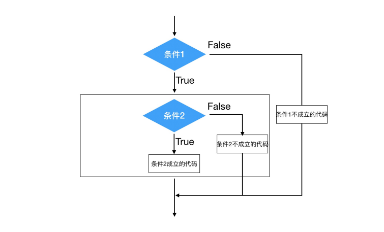

# 目标
* 条件语句作⽤
* if语法
* if...else...
* 多重判断
* if嵌套

## 了解条件语句
假设⼀个场景：
* 同学们这个年龄去过⽹吧吗？
* 去⽹吧进⻔想要上⽹必须做的⼀件事是做什么？（考虑重点）
* 为什么要把身份证给⼯作⼈员？
* 是不是就是为了判断是否成年？
* 是不是如果成年可以上⽹？如果不成年则不允许上⽹？

其实这⾥所谓的判断就是条件语句，即**条件成⽴执⾏某些代码，条件不成⽴则不执⾏这些代码**。
## if 语法
### 2.1 语法
```python
if 条件:
 条件成⽴执⾏的代码1
 条件成⽴执⾏的代码2
 ......
```
### 2.2 快速体验
```python
if True:
 print('条件成⽴执⾏的代码1')
 print('条件成⽴执⾏的代码2')
# 下⽅的代码没有缩进到if语句块，所以和if条件⽆关
print('我是⽆论条件是否成⽴都要执⾏的代码')
```
执⾏结果如下：
```
条件成⽴执⾏的代码1
条件成⽴执⾏的代码2
我是⽆论条件是否成⽴都要执⾏的代码
```
## 实例：上⽹
需求分析：如果⽤户年龄⼤于等于18岁，即成年，输出"已经成年，可以上⽹"。
### 3.1 简单版
```python
age = 20
if age >= 18:
 print('已经成年，可以上⽹')
print('系统关闭')
```
### 3.2 进阶版
新增需求：⽤户可以输出⾃⼰的年龄，然后系统进⾏判断是否成年，成年则输出"您的年龄是'⽤户输⼊
的年龄'，已经成年，可以上⽹"。
```python
# input接受⽤户输⼊的数据是字符串类型，条件是age和整型18做判断，所以这⾥要int转换数据类
型
age = int(input('请输⼊您的年龄：'))
if age >= 18:
 print(f'您的年龄是{age},已经成年，可以上⽹')
print('系统关闭')
```
## 四. if...else...
作⽤：条件成⽴执⾏if下⽅的代码; 条件不成⽴执⾏else下⽅的代码。
>思考：⽹吧上⽹的实例，如果成年，允许上⽹，如果不成年呢？是不是应该回复⽤户不能上⽹？
### 4.1 语法
```python
if 条件:
 条件成⽴执⾏的代码1
 条件成⽴执⾏的代码2
 ......
else:
 条件不成⽴执⾏的代码1
 条件不成⽴执⾏的代码2
 ......
```
### 4.2 实⽤版：⽹吧上⽹
```python
age = int(input('请输⼊您的年龄：'))
if age >= 18:
 print(f'您的年龄是{age},已经成年，可以上⽹')
else:
 print(f'您的年龄是{age},未成年，请⾃⾏回家写作业')
print('系统关闭')
```
>注意：如果某些条件成⽴执⾏了相关的代码，那么其他的情况的代码解释器根本不会执⾏。
## 五、多重判断
> 思考：中国合法⼯作年龄为18-60岁，即如果年龄⼩于18的情况为童⼯，不合法；如果年龄在18-
60岁之间为合法⼯龄；⼤于60岁为法定退休年龄。
### 5.1 语法
```python
if 条件1:
 条件1成⽴执⾏的代码1
 条件1成⽴执⾏的代码2
 ......
elif 条件2：
 条件2成⽴执⾏的代码1
 条件2成⽴执⾏的代码2
 ......
......
else:
 以上条件都不成⽴执⾏执⾏的代码
```
> 多重判断也可以和else配合使⽤。⼀般else放到整个if语句的最后，表示以上条件都不成⽴的时候
执⾏的代码。
### 5.2 实例：⼯龄判断
```python
age = int(input('请输⼊您的年龄：'))
if age < 18:
 print(f'您的年龄是{age},童⼯⼀枚')
elif age >= 18 and age <= 60:
 print(f'您的年龄是{age},合法⼯龄')
elif age > 60:
 print(f'您的年龄是{age},可以退休')
```
> 拓展： age >= 18 and age <= 60 可以化简为 18 <= age <= 60 。
## 六、if嵌套
> 思考：坐公交：如果有钱可以上⻋，没钱不能上⻋；上⻋后如果有空座，则可以坐下；如果没空
座，就要站着。怎么书写程序？
### 6.1 语法
```python
if 条件1：
 条件1成⽴执⾏的代码
 条件1成⽴执⾏的代码
 
 if 条件2：
 条件2成⽴执⾏的代码
 条件2成⽴执⾏的代码
```
> 注意：条件2的if也是出于条件1的缩进关系内部。
### 6.2 实例：坐公交
#### 6.2.1 判断是否能上⻋
```python
"""
1. 如果有钱，则可以上⻋
 2. 上⻋后，如果有空座，可以坐下
 上⻋后，如果没有空座，则站着等空座位
如果没钱，不能上⻋
"""
# 假设⽤ money = 1 表示有钱, money = 0表示没有钱
money = 1
if money == 1:
 print('⼟豪，不差钱，顺利上⻋')
else:
 print('没钱，不能上⻋，追着公交⻋跑')
```
#### 6.2.2 判断是否能坐下
```python
"""
1. 如果有钱，则可以上⻋
 2. 上⻋后，如果有空座，可以坐下
 上⻋后，如果没有空座，则站着等空座位
如果没钱，不能上⻋
"""
# 假设⽤ money = 1 表示有钱, money = 0表示没有钱; seat = 1 表示有空座，seat = 0 表示
没有空座
money = 1
seat = 0
if money == 1:
 print('⼟豪，不差钱，顺利上⻋')
 if seat == 1:
 print('有空座，可以坐下')
 else:
 print('没有空座，站等')
else:
 print('没钱，不能上⻋，追着公交⻋跑')
```
### 6.3 if嵌套执⾏流程

## 七. 应⽤：猜拳游戏
需求分析
+ 参与游戏的角色
    - 玩家
        + 手动出拳
    - 电脑
        - 自动出拳
+ 判断输赢
    - 玩家获胜

    | 玩家 | 电脑 |
    | ---- | ---- |
    | 剪刀 | 布 |
    | 石头 | 剪刀 |
    | 布 | 石头 |
    - 平局
        + 玩家出拳和电脑出拳相同
    - 电脑获胜

随机做法

1.导入random模块
```python
import random
```
2.使用random模块中的随机整数功能

```python
random.randint(开始，结束)
```
```python
"""
提示：0-⽯头，1-剪⼑，2-布
1. 出拳
玩家输⼊出拳
电脑随机出拳
2. 判断输赢
玩家获胜
平局
电脑获胜
"""
# 导⼊random模块
import random
# 计算电脑出拳的随机数字
computer = random.randint(0, 2)
print(computer)
player = int(input('请出拳：0-⽯头，1-剪⼑，2-布：'))
# 玩家胜利 p0:c1 或 p1:c2 或 p2:c0
if ((player == 0) and (computer == 1) or ((player == 1) and (computer == 2) or
((player == 2) and (computer == 0)):
 print('玩家获胜')
# 平局：玩家 == 电脑
elif player == computer:
 print('平局')
else:
 print('电脑获胜')
```
## ⼋. 三⽬运算符
三⽬运算符也叫三元运算符或三元表达式。
语法如下：
```python
条件成⽴执⾏的表达式 if 条件 else 条件不成⽴执⾏的表达式
```
快速体验
```python
a = 1
b = 2
c = a if a > b else b
print(c)
```
## 总结
+ if语句语法
```python
if 条件:
    条件成立执行的代码
```
+ if...else...
```python
if 条件:
    条件成立执行的代码
else:
    条件不成立执行的代码
```
+ 多重判断
```python
if 条件1:
    条件1成立执行的代码
elif 条件2:
    条件2成立执行的代码
else:
    以上条件都不成立执行的代码
```
+ if嵌套
```python
if 条件1:
    条件1成立执行的代码
    if 条件2:
        条件2成立执行的代码
        ....
```
+ 三目运算符
```python
条件成⽴执⾏的表达式 if 条件 else 条件不成⽴执⾏的表达式
```